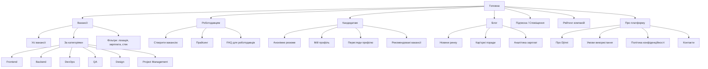

# To-Do-List

```mermaid
flowchart TD
  A[Головна] --> B[Вакансії]
  A --> C[Роботодавцям]
  A --> D[Кандидатам]
  A --> E[Блог]
  A --> F[Підписка / Сповіщення]
  A --> G[Рейтинг компаній]
  A --> H[Про платформу]

  B --> B1[Усі вакансії]
  B --> B2[За категоріями]
  B2 --> B21[Frontend]
  B2 --> B22[Backend]
  B2 --> B23[DevOps]
  B2 --> B24[QA]
  B2 --> B25[Design]
  B2 --> B26[Project Management]
  B --> B3[Фільтри: локація, зарплата, стек]

  C --> C1[Створити вакансію]
  C --> C2[Прайсинг]
  C --> C3[FAQ для роботодавців]

  D --> D1[Анонімне резюме]
  D --> D2[Мій профіль]
  D --> D3[Перегляди профілю]
  D --> D4[Рекомендовані вакансії]

  E --> E1[Новини ринку]
  E --> E2[Кар'єрні поради]
  E --> E3[Аналітика зарплат]

  H --> H1[Про Djinni]
  H --> H2[Умови використання]
  H --> H3[Політика конфіденційності]
  H --> H4[Контакти]

```
